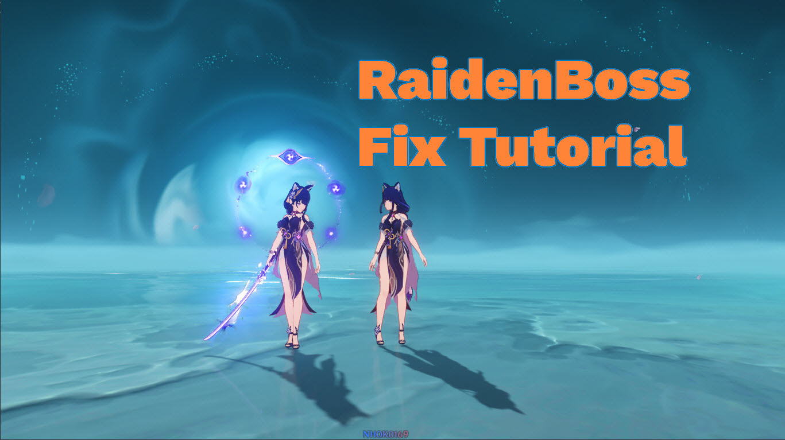

Welcome to FixRaidenBoss2's documentation!
===========================================

.. image:: https://img.shields.io/pypi/pyversions/FixRaidenBoss2    
    :alt: Python Version
    :target: https://www.python.org/downloads/

.. image:: https://img.shields.io/pypi/v/FixRaidenBoss2     
    :alt: Pypi Version
    :target: https://pypi.org/project/FixRaidenBoss2/

.. image:: https://img.shields.io/pypi/dm/FixRaidenBoss2?label=pypi%20downloads     
    :alt: Pypi Downloads
    :target: https://pypi.org/project/FixRaidenBoss2/

FixRaidenBoss2 is a library that helps fix Raiden Shogun Boss Phase 1 for all types of mods

Requirements
-------------

- Install `Python <https://www.python.org/downloads/>`_ version 3.6 or higher

Getting Started
---------------

- **Tutorial**: :doc:`tutorial`
- **Examples**: Lot of examples are available `here <https://github.com/nhok0169/Fix-Raiden-Boss/blob/nhok0169/Examples>`_
- **Command Options**: :doc:`commandOpts`

.. toctree::
  :caption: Script Fix
  :hidden:

  tutorial
  commandOpts

API
---

- **Setup**: :doc:`apiSetup`
- **Simple Examples**: :doc:`apiExamples`
- **API Reference**: :doc:`api`

.. toctree::
  :caption: API
  :hidden:

  apiSetup
  apiExamples
  api
